<!--
  Mohammed Al Sheqaih — Profile README
  Custom animated assets live in /assets. The 3D contribution calendar in
  /profile-3d-contrib is generated by the GitHub Action (.github/workflows/profile-3d.yml).
-->

<!-- ===================== ANIMATED HEADER ===================== -->

  <a href="https://github.com/MoAlsheqaih">
    
  </a>

<!-- ===================== TYPING HEADLINE ===================== -->

  

<!-- ===================== SOCIAL BADGES ===================== -->

 

<!-- ===================== ABOUT + ORB ===================== -->
<table>
<tr>
<td width="62%" valign="top">

## 👋 About Me

I'm an AI/ML engineer and software engineer who builds at the seam where **research-grade ML meets production engineering**, with a particular focus on **Arabic-language AI** and **accessibility for underserved communities**.

My journey started at **KFUPM** in Software Engineering — but it came alive when I started taking academic ideas and shipping them: a Conformer that drops Arabic sign-language WER **27 points below the baseline**, a YOLOv8-and-CRNN pipeline that beats a published bank-check benchmark by **3.5 points**, an indoor-navigation wearable for visually-impaired users with **&lt;30 cm error** and **87 ms latency**.

I've worn the hats of an **international SWE intern at Halliburton (Singapore)**, a **Qimam Fellow** (1 of 50 from 18,000+ applicants), a **researcher** authoring NeurIPS-format diagnostic studies, and a **builder** taking projects from a Figma file to a real user. The thread that ties them is the same: ship things that actually move the needle for the people they're meant for.

For me it's not the stack you reach for, it's whether the system feels obvious to the user. If it does, the engineering was right.

</td>
<td width="38%" valign="middle" align="center">


</td>
</tr>
</table>

---

<!-- ===================== HIGHLIGHTS ===================== -->
## ⭐ Highlights

🥇 &nbsp;**Grand Champion · Industrithon 2025** — 1st Place, Consulting Track (KFUPM × Pure Consulting) 
🥇 &nbsp;**Computing Projects EXPO 2025** — 1st Place, Web Engineering Development Path (KFUPM) 
🎓 &nbsp;**Qimam Fellow** — 1 of 50 selected from 18,000+ applicants nationwide (~0.28% acceptance) 
🌍 &nbsp;**International Engineering Intern** — Halliburton, Singapore · **Volunteer Fellow** — Forward7, Tanzania 
📝 &nbsp;**Research output** — NeurIPS-format diagnostic study · 20-page technical report exceeding published benchmarks

---

<!-- ===================== EDUCATION ===================== -->
## 🎓 Studied at

 

  

**BSc Software Engineering** &nbsp;·&nbsp; AI/ML Concentration &nbsp;·&nbsp; First Honors · Dean's List · Aug 2021 – May 2026

---

<!-- ===================== INTERNSHIP ===================== -->
## 💼 Interned at

 

 

*Software Engineer Intern · Tuas, Singapore 🇸🇬 · Jun – Aug 2025*

---

<!-- ===================== FELLOWSHIPS ===================== -->
## 🏆 Fellowships & Programs

 

<a href="https://qimam.com" title="Qimam Fellowship — 1 of 50 selected from 18,000+ applicants (Apr 2026)">
  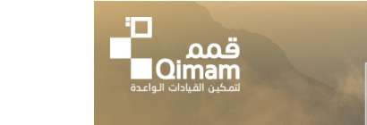
</a>
&nbsp;&nbsp;&nbsp;&nbsp;&nbsp;
<a href="https://misk.org.sa" title="Misk Hub Launchpad — 10-week idea → MVP program (Jun – Aug 2024)">
  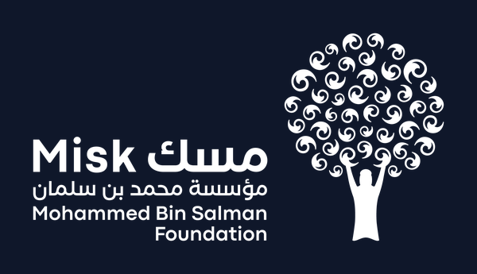
</a>
&nbsp;&nbsp;&nbsp;&nbsp;&nbsp;
<a href="https://x.com/forward7sa" title="Forward7 Clean Cooking — Middle East Green Initiative, Tanzania (Aug 2025)">
  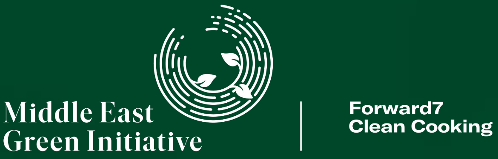
</a>

  

**Qimam Fellow** (1 of 50 from 18,000+) &nbsp;·&nbsp; **Misk Launchpad Graduate** &nbsp;·&nbsp; **Forward7 Volunteer Fellow** (1 of 10 Saudi students)

---

<!-- ===================== TECH STACK ===================== -->

## 💻 Tech Stack


🧠 Each branch lights up as a signal propagates through the network — full arsenal in the badges below 👇

#### 🛠️ Languages
    

#### 🧠 AI / ML / Research
         

#### 🌐 Web, Mobile & Backend
      

#### ⚙️ Tools, IoT & Cloud
       

---

<!-- ===================== PROJECTS ===================== -->
## 🚀 Key Projects

<table>
<tr>
<td width="38%" align="center" valign="middle">
</td>
<td width="62%" valign="top">

### 🧭 NavSense: Indoor Navigation with a Haptic Wearable *(Senior Capstone)*

An **indoor navigation platform for visually-impaired users** — a cross-platform **Flutter** mobile app, a **Python** optimization backend, and a custom **BLE-driven ESP32 haptic wristband**. Concept to validated prototype in one semester, co-led across a **6-person SWE / COE / EE / ISE team**.

Built the **real-time positioning pipeline** (UWB time-of-flight trilateration + BLE beacon fusion), the **haptic command state machine** driving the wristband, and a **MIP route optimizer** (PuLP + CBC on a 1,450-node floor graph) — **87 ms** end-to-end latency, **&lt;30 cm** localization error. Delivered against **18 quantitative specs**: 100% WCAG 2.1 AA accessibility, full English/Arabic bilingual UI, **419 SAR/unit BOM (77% below market)**.

    
&nbsp;

</td>
</tr>

<tr>
<td width="38%" align="center" valign="middle">
</td>
<td width="62%" valign="top">

### 🏦 Arabic Bank Check Amount Extraction & Verification

A **4-stage** Arabic check verification pipeline: **YOLOv8s** field detector → **CRNN-CTC** digit reader → character-level **CRNN** Arabic recognizer → rule-based cross-verifier. Reached **95.17% digit accuracy**, **9.02% legal CER** (a **5.6× cut** from 50.5%), and **82.0% end-to-end accuracy**, **beating the 78.5% published benchmark** through custom RTL preprocessing and dictionary post-processing on **600 held-out checks**.

Co-led all phases with a teammate; authored the full **20-page LaTeX technical report**. Trained on NVIDIA RTX 5060.

   

</td>
</tr>

<tr>
<td width="38%" align="center" valign="middle">
</td>
<td width="62%" valign="top">

### 🎨 Diagnosing Failure Modes in AnyDoor *(StressDoor — CV Research)*

A diagnostic study of **AnyDoor's zero-shot object-insertion pipeline** on a **100-case stress benchmark (StressDoor)**. Surfaced three structural defects: a **mask-collapse** preprocessing bug corrupting **22%** of hard cases, a **metric–perception gap** where DINO-driven IHT gains below ~0.3 are sub-perceptual, and **intervention non-additivity** — two individually-effective fixes interfered destructively in **63%** of cases.

Prototyped two targeted interventions — pre-projection **DINO + CLIP** token fusion and a **rank-8 LoRA** adapter on DINOv2 — lifting harmonization quality from **0.578 → 0.655**. NeurIPS-format paper, **9 ablation runs on NVIDIA A100**.

    

</td>
</tr>

<tr>
<td width="38%" align="center" valign="middle">
</td>
<td width="62%" valign="top">

### 🤟 Pose-Based Saudi Sign Language Recognition

An end-to-end pipeline translating **continuous Arabic Sign Language video → Arabic gloss text** on the **Isharah 1000** dataset (10,000+ samples). Extracted **86-joint skeletal pose** sequences and benchmarked four architectures — BiLSTM+CTC, Transformer+CTC, **Conformer+CTC**, Conformer+Seq2Seq.

Reached a best **WER of 8.76%**, outperforming the BiLSTM baseline by **27+ percentage points**, with a 7-type augmentation pipeline. Only team to submit on the full 3,800-sample held-out test set.

   

</td>
</tr>

<tr>
<td width="38%" align="center" valign="middle">
</td>
<td width="62%" valign="top">

### 🦊 Thaheen: Gamified Learning Platform

A full-stack **MERN** platform tackling a problem every KFUPM student hits — the shortage of high-quality practice questions in core courses — by layering on Kahoot-style live events to make studying genuinely fun. Validated via student survey and 1-on-1 interviews.

Four user roles (**Admin**, **Question Master**, **Regular User**, **Guest**), real-time question generation via the **OpenAI API**, Tailwind UI, deployed on **Vercel** (frontend) + **Heroku** (backend). **Won 1st Place** at KFUPM Computing Projects EXPO 2025 (Web Engineering Development Path).

    
&nbsp;

</td>
</tr>
</table>

---

<!-- ===================== 3D CONTRIBUTION CALENDAR ===================== -->

## 🧊 My Year in 3D

<!-- Auto-generated daily by the github-profile-3d-contrib Action (.github/workflows/profile-3d.yml).
     "night-view" is animated (bars rise, twinkling sky). It appears after the workflow has run once. -->
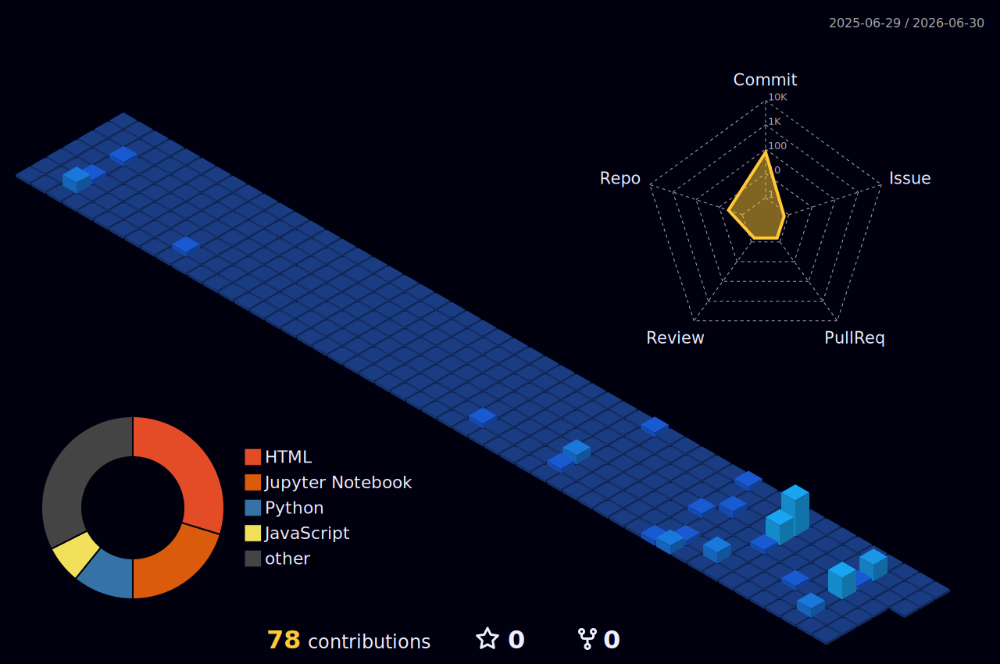

---

<!-- ===================== GITHUB STATS ===================== -->

## 📊 GitHub Stats

 

### 📈 Contribution Activity

## 🏆 GitHub Trophies

---

<!-- ===================== CONTRIBUTION SNAKE ===================== -->

## 🐍 Contribution Snake

<picture>
  <source media="(prefers-color-scheme: dark)"  srcset="https://raw.githubusercontent.com/MoAlsheqaih/MoAlsheqaih/output/github-contribution-grid-snake-dark.svg"/>
  <source media="(prefers-color-scheme: light)" srcset="https://raw.githubusercontent.com/MoAlsheqaih/MoAlsheqaih/output/github-contribution-grid-snake.svg"/>
  
</picture>

---

<!-- ===================== FOOTER WAVE ===================== -->

