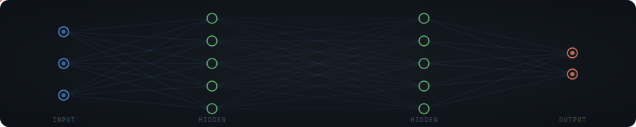
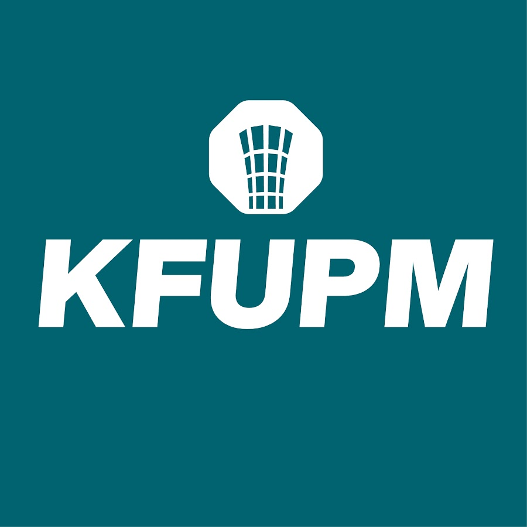
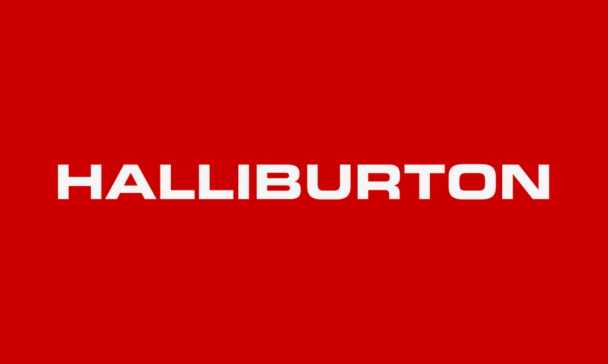
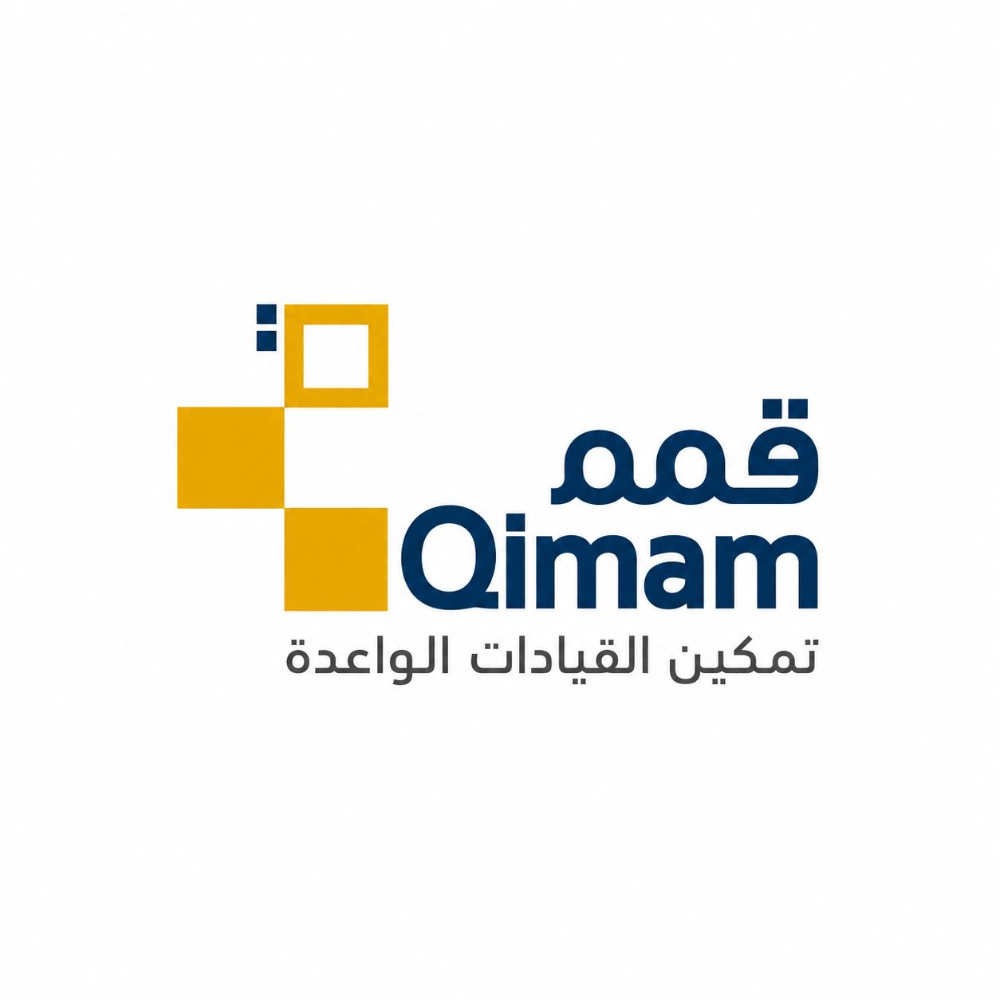

  

---

---

## 👋 About Me

I'm an AI/ML engineer and software engineer from Dhahran, Saudi Arabia. I build systems that sit at the intersection of **research-grade ML and production engineering** — with a particular focus on Arabic-language AI and accessibility for underserved communities.

My work spans deep learning architectures (Conformer, CRNN+CTC, LoRA fine-tuning on DINOv2/CLIP), full-stack web, and embedded IoT. I've shipped models that exceed published academic benchmarks, authored NeurIPS-format research papers, and built cross-platform apps with real users.

---

## ⭐ Highlights

🥇 &nbsp;**Grand Champion · Industrithon 2025** — 1st Place, Consulting Track (KFUPM × Pure Consulting) 
🥇 &nbsp;**Computing Projects EXPO 2025** — 1st Place, Web Engineering Development Path (KFUPM) 
🎓 &nbsp;**Qimam Fellow** — 1 of 50 selected from 18,000+ applicants nationwide (~0.28% acceptance) 
🌍 &nbsp;**International Engineering Intern** — Halliburton, Singapore · **Volunteer Fellow** — Forward7, Tanzania 
📝 &nbsp;**Research output** — NeurIPS-format diagnostic study · technical reports exceeding published benchmarks

---

## 🎓 Studied at

 

  

**BSc Software Engineering** &nbsp;·&nbsp; AI/ML Concentration &nbsp;·&nbsp; First Honors · Dean's List · Aug 2021 – May 2026

---

## 💼 Interned at

 

 

*Software Engineer Intern · Tuas, Singapore 🇸🇬 · Jun – Aug 2025*

---

## 🏆 Fellowships & Programs

 

&nbsp;&nbsp;&nbsp;&nbsp;&nbsp;

&nbsp;&nbsp;&nbsp;&nbsp;&nbsp;

  

**Qimam Fellow** (1 of 50 from 18,000+) &nbsp;·&nbsp; **Misk Launchpad Graduate** &nbsp;·&nbsp; **Forward7 Volunteer Fellow** (1 of 10 Saudi students)

---

## 🛠️ Tech Stack

**AI & Machine Learning**

&nbsp;

**Web & Backend**

**Mobile & IoT**

&nbsp;

**Tools**

---

## 🚀 Featured Projects

&nbsp;<b>🔤 Arabic Bank Check Processing</b> — NLP / OCR &nbsp;·&nbsp; <i>exceeded academic benchmark by +3.5pp</i>

 

End-to-end deep learning pipeline for Arabic handwritten bank check processing.

| Metric | Result |
|:---|:---|
| End-to-end verification accuracy | **82.0%** on 600-check held-out test |
| Arabic character error rate | **9.02%** — 5.6× reduction (from 50.5%) |
| Digit recognition accuracy | **95.17%** |
| vs. published academic benchmark | **+3.5 percentage points** |

- **YOLOv8s** for amount-region detection (63.35% mean IoU)  
- Dual **CRNN+CTC** branch: digits + Arabic text  
- RTL flip preprocessing + character-level vocabulary redesign  
- Full 20-page LaTeX technical report · Trained on NVIDIA RTX 5060

`Python` `PyTorch` `YOLOv8` `CRNN` `CTC` `Albumentations`

&nbsp;<b>🤟 Saudi Sign Language Recognition</b> — Deep Learning &nbsp;·&nbsp; <i>8.76% WER · 80% reduction over baseline</i>

 

End-to-end pipeline translating Arabic Sign Language videos → Arabic text.

| Model | Dev WER | Test WER |
|:---|:---|:---|
| BiLSTM + CTC (baseline) | ~43% | — |
| Transformer + CTC | — | — |
| **Conformer + CTC** | **13.04%** | — |
| **Conformer + Seq2Seq** | — | **8.76%** |

- 86-joint skeleton pose data (hands, face, body) · 7-type augmentation pipeline  
- Isharah 1000 dataset: 10,000+ labeled samples  
- Identified decoder collapse failure mode in Seq2Seq  
- Only team to submit on the full 3,800-sample test set

`Python` `PyTorch` `Conformer` `CTC Loss` `AdamW` `OneCycleLR`

&nbsp;<b>🧭 NavSense — Indoor Navigation + Haptic Wearable</b> — Mobile / IoT &nbsp;·&nbsp; <i>87ms latency · &lt;30cm error</i>

 

Cross-platform Flutter app + custom BLE-driven haptic ESP32 wristband for accessible indoor navigation.

- UWB time-of-flight trilateration + BLE beacon fusion pipeline  
- MIP route optimizer (PuLP + CBC solver) on a 1,450-node floor graph  
- **87ms** mean end-to-end latency · **<30cm** localization error  
- 18 quantitative specs met: 100% WCAG 2.1 AA · full EN/AR bilingual UI · 185ms response under 200-user load  
- Hardware BOM: 419 SAR/unit (77% below market)

`Flutter` `Dart` `ESP32` `Python` `PuLP` `BLE` `UWB`

&nbsp;<b>🔬 AnyDoor Failure-Mode Diagnostic</b> — Computer Vision Research &nbsp;·&nbsp; <i>NeurIPS format · A100 GPU · 9 ablations</i>

 

Systematic diagnostic study of AnyDoor's zero-shot object-insertion pipeline on a 100-case stress benchmark (StressDoor).

**Three findings:**
1. **Mask-collapse** — 5×5 binary erosion zeros reference masks on thin foregrounds (22/100 cases produce byte-identical renders regardless of HF-map choice → caps any spatial intervention at 78% reach)
2. **Metric-perception gap** — DINO-driven IHT improvements below baseline IHT ≈ 0.3 don't correspond to visible changes
3. **Non-additivity** — Pairwise interventions interfere destructively in 63/100 cases

**Two interventions prototyped:**
- Pre-projection DINO + CLIP token fusion: viable only at w_dino=0.85 (+0.016 IHT overall)
- Rank-8 LoRA on DINOv2 blocks 36–39: +0.027 stacked IHT with CFG schedule

15-page paper (NeurIPS format) · 9 ablation runs on NVIDIA A100

`Python` `PyTorch` `DINOv2` `CLIP` `LoRA` `SMIL`

&nbsp;<b>🎓 Thaheen — Gamified Learning Platform</b> — Full-Stack Web &nbsp;·&nbsp; <i>🏆 1st Place Computing EXPO 2025</i>

 

AI-powered gamified quiz generation platform for university students (Kahoot-style).

- OpenAI API integration for automatic question generation  
- 4 user roles: Admin, Question Master, Regular User, Guest  
- Full-stack MERN — deployed on Vercel (frontend) + Heroku (backend)  
- **Won 1st Place** at Computing Projects EXPO 2025 (Web Engineering Development Path, KFUPM)

`React` `Node.js` `MongoDB` `Express.js` `TailwindCSS` `OpenAI API`

---

## 📊 GitHub Stats

---

## 🐍 Contribution Graph

  <picture>
    <source media="(prefers-color-scheme: dark)"  srcset="https://raw.githubusercontent.com/MoAlsheqaih/MoAlsheqaih/output/github-contribution-grid-snake-dark.svg"/>
    <source media="(prefers-color-scheme: light)" srcset="https://raw.githubusercontent.com/MoAlsheqaih/MoAlsheqaih/output/github-contribution-grid-snake.svg"/>
    
  </picture>

---

